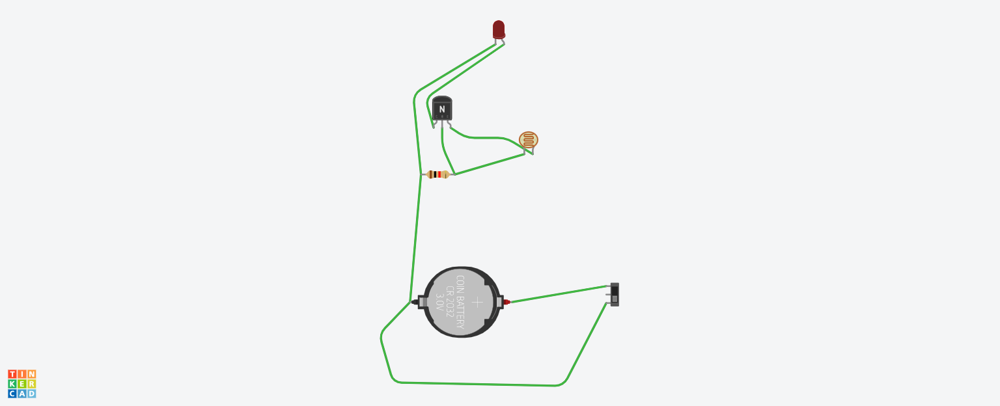

# Computer Vision Security Camera
This project uses a Raspberry Pi Zero Wireless and a Raspberry Pi Camera Module to detect moving objects and alert the user. Python and openCV is used to detect objects in the video feed and when movement is detected, an email containing an image of the object will be sent. 

| **Engineer** | **School** | **Area of Interest** | **Grade** |
|:--:|:--:|:--:|:--:|
| Jonathan L | Monta Vista High School | Computer Science | Incoming Junior

<!---  -->
  
<!--- # Final Milestone
My final milestone was to completely assemble the Computer Vision Security Camera by inserting the Raspberry Pi and USB camera to the casing.

<iframe width="560" height="315" src="https://www.youtube.com/embed/F7M7imOVGug" title="YouTube video player" frameborder="0" allow="accelerometer; autoplay; clipboard-write; encrypted-media; gyroscope; picture-in-picture; web-share" allowfullscreen></iframe>
-->

<!--- # Second Milestone
My second milestone was assembling the casing of the security camera. Using Onshape, I created a 3D model of the exterior casing and added the holes needed to plug in the cables for the camera and the Raspberry Pi. The main difficulty was learning how to use CAD to create a 3D model, but the rest of the process was relatively simplistic. 

<iframe width="560" height="315" src="https://www.youtube.com/embed/y3VAmNlER5Y" title="YouTube video player" frameborder="0" allow="accelerometer; autoplay; clipboard-write; encrypted-media; gyroscope; picture-in-picture; web-share" allowfullscreen></iframe> 
-->

# First Milestone
My first milestone was setting the Raspberry Pi up and installing the necessary programs to run the code. I installed Raspberry Pi Imager and OBS Studio to set up the SD card for the Raspberry Pi and connect the Pi to my laptop. I used openCV to detect objects in the video and send emails with an image of the object boxed in green. In this section  of the project, I faced the most challenges when I was first trying to set up the Raspberry Pi. The Raspberry Pi's plastic connector was broken, so it was unable to detect the camera module. Initially, the program on the SD card was corrupted, so I had to reinstall it. My next goal is to assemble the casing of the security camera. 

<!--- <iframe width="560" height="315" src="https://www.youtube.com/embed/CaCazFBhYKs" title="YouTube video player" frameborder="0" allow="accelerometer; autoplay; clipboard-write; encrypted-media; gyroscope; picture-in-picture; web-share" allowfullscreen></iframe> -->

# Schematics 



# Code
Main:
```python
import cv2
import sys
from mail import sendEmail
from flask import Flask, render_template, Response
from camera import VideoCamera
from flask_basicauth import BasicAuth
import time
import threading

email_update_interval = 120 # sends an email only once in this time interval
video_camera = VideoCamera(flip=True) # creates a camera object, flip vertically
object_classifier = cv2.CascadeClassifier("models/fullbody_recognition_model.xml") # an opencv classifier

# App Globals 
app = Flask(__name__)
app.config['BASIC_AUTH_USERNAME'] = 'DEFAULT_USERNAME'
app.config['BASIC_AUTH_PASSWORD'] = 'DEFAULT_PASSWORD'
app.config['BASIC_AUTH_FORCE'] = True

basic_auth = BasicAuth(app)
last_epoch = 0

def check_for_objects():
	global last_epoch
	while True:
		try:
			frame, found_obj = video_camera.get_object(object_classifier)
			if found_obj and (time.time() - last_epoch) > email_update_interval:
				last_epoch = time.time()
				print("Sending email...")
				sendEmail(frame)
				print("done!")
		except:
			print ("Error sending email: "), sys.exc_info()[0]

@app.route('/')
@basic_auth.required
def index():
    return render_template('index.html')

def gen(camera):
    while True:
        frame = camera.get_frame()
        yield (b'--frame\r\n'
               b'Content-Type: image/jpeg\r\n\r\n' + frame + b'\r\n\r\n')

@app.route('/video_feed')
def video_feed():
    return Response(gen(video_camera),
                    mimetype='multipart/x-mixed-replace; boundary=frame')

if __name__ == '__main__':
    t = threading.Thread(target=check_for_objects, args=())
    t.daemon = True
    t.start()
    app.run(host='0.0.0.0', debug=False)
```
Camera:
```python
import cv2
from imutils.video.pivideostream import PiVideoStream
import imutils
import time
import numpy as np

class VideoCamera(object):
    def __init__(self, flip = False):
        self.vs = cv2.VideoCapture(0)
        self.flip = flip
        time.sleep(2.0)

    def __del__(self):
        self.vs.stop()

    def flip_if_needed(self, frame):
        if self.flip:
            return np.flip(frame, 0)
        return frame

    def get_frame(self):
        ret, frame = self.vs.read()
        ret, jpeg = cv2.imencode('.jpg', frame)
        return jpeg.tobytes()

    def get_object(self, classifier):
        found_objects = False
        ret, frame = self.vs.read()
        gray = cv2.cvtColor(frame, cv2.COLOR_BGR2GRAY)

        objects = classifier.detectMultiScale(
            gray,
            scaleFactor=1.1,
            minNeighbors=5,
            minSize=(30, 30),
            flags=cv2.CASCADE_SCALE_IMAGE
        )

        if len(objects) > 0:
            found_objects = True

        # Draw a rectangle around the objects
        for (x, y, w, h) in objects:
            cv2.rectangle(frame, (x, y), (x + w, y + h), (0, 255, 0), 2)

        ret, jpeg = cv2.imencode('.jpg', frame)
        return (jpeg.tobytes(), found_objects)
```
Mail:
```python
import smtplib
from email.mime.Multipart import MIMEMultipart
from email.mime.Text import MIMEText
from email.mime.Image import MIMEImage

# Email you want to send the update from (only works with gmail)
fromEmail = 'email@gmail.com'
# You have to generate an app password since Gmail does not allow less secure apps anymore
# https://support.google.com/accounts/answer/185833?hl=en
fromEmailPassword = 'password'

# Email you want to send the update to
toEmail = 'email2@gmail.com'

def sendEmail(image):
	msgRoot = MIMEMultipart('related')
	msgRoot['Subject'] = 'Security Update'
	msgRoot['From'] = fromEmail
	msgRoot['To'] = toEmail
	msgRoot.preamble = 'Raspberry pi security camera update'

	msgAlternative = MIMEMultipart('alternative')
	msgRoot.attach(msgAlternative)
	msgText = MIMEText('Smart security cam found object')
	msgAlternative.attach(msgText)

	msgText = MIMEText('', 'html')
	msgAlternative.attach(msgText)

	msgImage = MIMEImage(image)
	msgImage.add_header('Content-ID', '<image1>')
	msgRoot.attach(msgImage)

	smtp = smtplib.SMTP('smtp.gmail.com', 587)
	smtp.starttls()
	smtp.login(fromEmail, fromEmailPassword)
	smtp.sendmail(fromEmail, toEmail, msgRoot.as_string())
	smtp.quit()
```

# Bill of Materials

| **Part** | **Note** | **Price** | **Link** |
|:--:|:--:|:--:|:--:|
| Raspberry Pi Zero Wireless | Core of the project | $47.98 | <a href="https://www.amazon.com/Raspberry-Pi-Zero-Wireless-model/dp/B06XFZC3BX/ref=sr_1_4?crid=3B0E18NIUI98U&keywords=raspberry+pi+zero+wireless&qid=1686867252&sprefix=raspberry+pi+zero+wireles%2Caps%2C142&sr=8-4"> Link </a> |
|:--:|:--:|:--:|:--:|
| Raspberry Pi Camera Module | Camera for video/pictures | $12.99 | <a href="https://www.amazon.com/Arducam-Raspberry-Camera-Module-1080P/dp/B07RWCGX5K/ref=sr_1_2?crid=2KYR896ILMK3E&keywords=raspberry+pi+camera+module+case+x0026amufb&qid=1686867858&sprefix=raspberry+pi+camera+module+case+x0026amufb%2Caps%2C125&sr=8-2"> Link </a> |
|:--:|:--:|:--:|:--:|
| Adafruit Raspberry Pi Zero Camera Cable | Needed to replace the cable that comes with the camera module | $8.99 | <a href="https://www.amazon.com/Arducam-Raspberry-Camera-Ribbon-Extension/dp/B085RW9K13/ref=sr_1_3?crid=WTTYEX49MHKT&keywords=raspberry+pi+zero+camera+cable&qid=1686867551&sprefix=raspberry+pi+zero+camera+cabl%2Caps%2C134&sr=8-3"> Link </a> |
|:--:|:--:|:--:|:--:|
| Micro-USB to USB Cable (Generic) | For connection to Raspberry Pi | $2.10 | <a href="https://www.sparkfun.com/products/13244"> Link </a> |
|:--:|:--:|:--:|:--:|
| Mini Camera Case | Outside casing of the camera | $7.66 | <a href="https://thepihut.com/products/pi-zero-camera-case"> Link </a> |
|:--:|:--:|:--:|:--:|
| 4K HDMI Video Capture | Used to connect HDMI cable to laptop | $22.99 | <a href="https://www.amazon.com/Capture-Streaming-Broadcasting-Conference-Teaching/dp/B09FLN63B3/ref=sr_1_3?keywords=hdmi+video+capture&qid=1686867712&sr=8-3"> Link </a> |
|:--:|:--:|:--:|:--:|
| 2.5A Power Supply Bank | Used to connect power to the Pi | $19.95 | <a href="https://www.amazon.com/CanaKit-Raspberry-Supply-Adapter-Listed/dp/B00MARDJZ4/ref=sr_1_3?crid=1NS6SLR38G1AQ&keywords=canakit+2.5a+micro+usb+power+supply&qid=1686867784&sprefix=cana+kit+2.5a%2Caps%2C133&sr=8-3"> Link </a> |
|:--:|:--:|:--:|:--:|
| Micro USB OTG Hub | Used to connect more devices to the Pi | $14.99 | <a href="https://www.amazon.com/AuviPal-Adapter-Playstation-Classic-Raspberry/dp/B083WML1XB/ref=sr_1_3?crid=3IB7WWRWLGLVF&keywords=micro+usb+otg+hub&qid=1686867991&sprefix=micro+usb+otg+hub%2Caps%2C139&sr=8-3"> Link </a> |
|:--:|:--:|:--:|:--:|
| Amazon Basics Mini-HDMI to HDMI Adapter Cable | Used to connect to the display | $8.79 | <a href="https://www.amazon.com/AmazonBasics-High-Speed-Mini-HDMI-Adapter-Cable/dp/B014I8UEGY/ref=sr_1_5?crid=TYOCNK03XAZK&keywords=mini-hdmi+to+hdmi+tv&qid=1686868083&sprefix=mini-hdmi+to+hdmi+tv%2Caps%2C134&sr=8-5"> Link </a> |
|:--:|:--:|:--:|:--:|
| Micro SD Card | Transfer Raspberry Pi data | $17.09 | <a href="https://www.amazon.com/Amazon-Basics-microSDXC-Memory-Adapter/dp/B08TJRVWV1/ref=sr_1_4?crid=3GM706GDFOWJW&keywords=micro+sd+card&qid=1686869609&s=electronics&sprefix=micro+sd+card%2Celectronics%2C145&sr=1-4"> Link </a> |
|:--:|:--:|:--:|:--:|

# Starter Project
My first project was the Mini Cat Lamp. This project uses a simple circuit which was soldered together to create a mini cat that has an LED on its back that lights up when it becomes dark. In this project, I learned how to properly use tools for soldering and apply what I learned to a real-life creation. I first had to completely assemble the cat body board. I inserted the LED, transistor, resistor, and photoresistor into the cat body board. Then, I proceeded to use the soldering iron to solder each of these parts into the board. At first, I was unfamiliar with soldering, and so the initial soldering was messy, requiring me to clean up the solder left outside the pins. The most important part was the photoresistor, which would limit the electricity flow if light was detected. 

After completing this, I would need to assemble the base of the Mini Cat Lamp. I soldered the battery holder and switch into the base. It was imporant to pay attention to the orientation of each part to prevent soldering them on incorrectly, since desoldering the parts would be tedious. I was surprised at how the soldering iron would also melt the plastic circuit board, and so I tried to minimize the time taken to finish soldering. 

To completely assemble the Mini Cat Lamp, I combined both the cat body circuit board and the base. Soldering the cat's arms to its torso, I inserted the cat body into the gold tabs in the base. I inserted the standoffs needed to keep the base upright into the sides and soldered each part together. Then, I inserted a battery into the bottom of the base. Finally, when the switch was turned on, the Mini Cat Lamp's LED light would turn on when it turned dark. Through this project, I learned how to solder and how an electrical circuit worked.

<iframe width="560" height="315" src="https://www.youtube.com/embed/WCWzYgzLuSQ" title="YouTube video player" frameborder="0" allow="accelerometer; autoplay; clipboard-write; encrypted-media; gyroscope; picture-in-picture; web-share" allowfullscreen></iframe>

