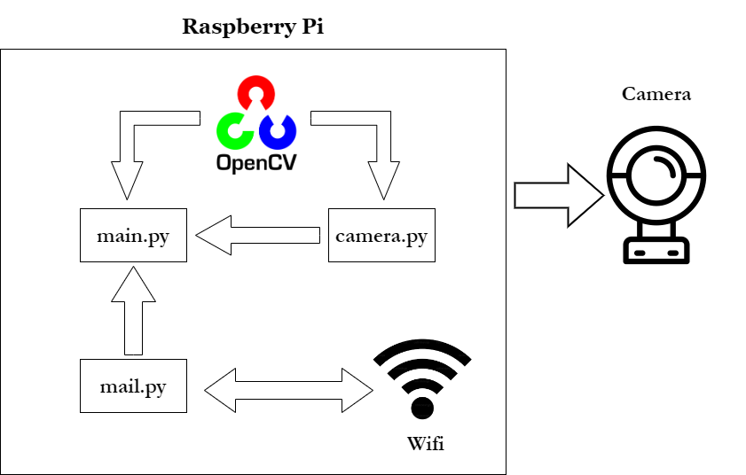

# Computer Vision Security Camera
This project uses a Raspberry Pi Zero Wireless and an USB camera to detect moving objects and alert the user. Python and openCV is used to detect objects in the video feed and when movement is detected, two emails will be sent. The initial email contains a photo of the object, while the next email contains a twenty-second short video. I used the libraries pyaudio, wave, threading, and fmmpeg to sync the audio and video. The user can also choose to view the live video feed of the security camera if the Raspberry Pi and their personal device are connected to the same network. 

| **Engineer** | **School** | **Area of Interest** | **Grade** |
|:--:|:--:|:--:|:--:|
| Jonathan L | Monta Vista High School | Computer Science | Incoming Junior

<!---  --> 
<!---  -->


# Modifications 
I created a simple security camera that detects motion and sends a notification via email to the user, but wouldn't it be even better if it had more functions like a modern camera? Previously, the camera only sends an image of the object in the email, but I also wanted to send a short video so the intruder's actions could be recorded. Here are each of the modifications I made to each class in order to add a video.

camera.py: I added the `get_video()` method to record a short video with open-cv.
```python
# import libraries
import cv2
import imutils
import time
import numpy as np
import threading

class VideoCamera(object):
    # camera constructor
    def __init__(self, flip = False):
        self.vs = cv2.VideoCapture(0) # use cv2's video capture function
        self.flip = flip
	self.frame_counts = 1
	self.video_out = cv2.VideoWriter('output.avi', cv2.VideoWriter_fourcc(*'MJPG'), 10, (640, 480)) # create a VideoWriter object
        time.sleep(2.0)

    # delete camera object
    def __del__(self):
        self.vs.stop()

    # flips camera object
    def flip_if_needed(self, frame):
        if self.flip:
            return np.flip(frame, 0)
        return frame

    # Return a single frame taken by the camera
    def get_frame(self):
        ret, frame = self.vs.read()
        ret, jpeg = cv2.imencode('.jpg', frame)
        return jpeg.tobytes()

    # Get a short video from the camera
    def get_video(self):
 	self.frame_counts = 1
  	t_end = time.time() + 20
   	while(time.time() < t_end): # loop for 20 seconds
    	      	ret, frame = self.vs.read() # read from camera
		self.frame_counts += 1 
		
  		if ret == True:
			self.video_out.write(frame) # Add frame to the video

    	      	else:
	 		break
   	self.video_out.release() # Release VideoWriter
        cv2.destroyAllWindows() # Deallocate data

    # Start the thread
    def start(self):
	    video_thread = threading.Thread(target=self.get_video)
	    video_thread.start()
  
    # Look for an object and return image
    def get_object(self, classifier):
        found_objects = False
        ret, frame = self.vs.read()
        gray = cv2.cvtColor(frame, cv2.COLOR_BGR2GRAY)

        objects = classifier.detectMultiScale(
            gray,
            scaleFactor=1.1,
            minNeighbors=5,
            minSize=(30, 30),
            flags=cv2.CASCADE_SCALE_IMAGE
        ) # call classifier method

        if len(objects) > 0:
            found_objects = True

        # Draw a rectangle around the objects
        for (x, y, w, h) in objects:
            cv2.rectangle(frame, (x, y), (x + w, y + h), (0, 255, 0), 2)

        ret, jpeg = cv2.imencode('.jpg', frame) 
        return (jpeg.tobytes(), found_objects)
```
mail.py: I imported MIMEBase and encoders to encode the file into base 64. I created a new method `sendVideo()` to send the video.
```python
# import libraries
import smtplib
from email.mime.Multipart import MIMEMultipart
from email.mime.Text import MIMEText
from email.mime.base import MIMEBase
from email.mime.Image import MIMEImage
from email.mime.application import MIMEApplication
from email import encoders
from recorder import clean_up_files

# Email you want to send the update from (only works with gmail)
fromEmail = 'email@gmail.com'
# You have to generate an app password since Gmail does not allow less secure apps anymore
# https://support.google.com/accounts/answer/185833?hl=en
fromEmailPassword = 'password'

# Email you want to send the update to
toEmail = 'email2@gmail.com'

# Send a video via email
def sendVideo():
  	video_file = MIMEBase('application', 'octet-stream') # create binary file
  	video_file.set_payload(open('output.avi', 'rb').read()) # read from file

  	encoders.encode_base64(video_file) 
  	video_file.add_header('Content-Disposition', 'attachment: filename = {}'.format("output.avi")) # add a header
	
  	msgRoot = MIMEMultipart('related')
	msgRoot['Subject'] = 'Security Update: Video' 
	msgRoot['From'] = fromEmail
	msgRoot['To'] = toEmail
	msgRoot.preamble = 'Raspberry pi security camera update'

	msgAlternative = MIMEMultipart('alternative')
	msgRoot.attach(msgAlternative)
	msgText = MIMEText('Smart security cam found object') # add description
	msgAlternative.attach(msgText) 
 	msgRoot.attach(video_file)

	smtp = smtplib.SMTP('smtp.gmail.com', 587)
	smtp.starttls()
	smtp.login(fromEmail, fromEmailPassword) # access gmail
	smtp.sendmail(fromEmail, toEmail, msgRoot.as_string())
	smtp.quit()
	clean_up_files() # removes old video and audio files

# Send an image via email
def sendImage(image):
	msgRoot = MIMEMultipart('related')
	msgRoot['Subject'] = 'Security Update'
	msgRoot['From'] = fromEmail
	msgRoot['To'] = toEmail
	msgRoot.preamble = 'Raspberry pi security camera update'

	msgAlternative = MIMEMultipart('alternative')
	msgRoot.attach(msgAlternative)
	msgText = MIMEText('Smart security cam found object') # add description
	msgAlternative.attach(msgText) 

	msgText = MIMEText('', 'html')
	msgAlternative.attach(msgText)

	msgImage = MIMEImage(image)
	msgImage.add_header('Content-ID', '<image1>')
	msgRoot.attach(msgImage) # add the image taken 

	smtp = smtplib.SMTP('smtp.gmail.com', 587)
	smtp.starttls()
	smtp.login(fromEmail, fromEmailPassword) # access gmail
	smtp.sendmail(fromEmail, toEmail, msgRoot.as_string())
	smtp.quit()
```
main.py: I called the `record()` method from `recorder.py` and `sendVideo()` method from `mail.py`.

```python
# import libraries
import cv2 
import sys
from mail import sendImage, sendVideo
from flask import Flask, render_template, Response
from camera import VideoCamera
from mic import Microphone
from recorder import record
from flask_basicauth import BasicAuth
import time
import threading

email_update_interval = 60 # sends an email only once in this time interval
video_camera = VideoCamera(flip=True) # creates a camera object, flip vertically
mic = Microphone() # creates a microphone object
object_classifier = cv2.CascadeClassifier("models/upperbody_recognition_model.xml") # an opencv classifier

# App Globals for viewing live video feed
app = Flask(__name__)
app.config['BASIC_AUTH_USERNAME'] = 'DEFAULT_USERNAME' # Change username and password
app.config['BASIC_AUTH_PASSWORD'] = 'DEFAULT_PASSWORD'
app.config['BASIC_AUTH_FORCE'] = True

basic_auth = BasicAuth(app)
last_epoch = 0

def check_for_objects():
	global last_epoch
	while True:
		try:
			frame, found_obj = video_camera.get_object(object_classifier)
			if found_obj and (time.time() - last_epoch) > email_update_interval: # check if enough time is elapsed and if object is found
				last_epoch = time.time()
				print("Sending email...")
        			sendImage(frame) # Send image
        			record(video_camera, mic) # Record video
				sendVideo() # Send video
				print("done!")
		except Exception as e:
			print("Error sending email: ", __type(e).__name__, e) # Return exception
			

# launch basic server 
@app.route('/')
@basic_auth.required 
def index():
    return render_template('index.html')

# return frame
def gen(camera):
    while True:
        frame = camera.get_frame()
        yield (b'--frame\r\n'
               b'Content-Type: image/jpeg\r\n\r\n' + frame + b'\r\n\r\n')

# Generate video feed
@app.route('/video_feed')
def video_feed():
    return Response(gen(video_camera),
                    mimetype='multipart/x-mixed-replace; boundary=frame')

if __name__ == '__main__':
    t = threading.Thread(target=check_for_objects, args=())
    t.daemon = True
    t.start() 
    app.run(host='0.0.0.0', debug=False) # make it accessible to every device on the network
```
Since openCV's VideoCapture doesn't include audio, I also decided to combine the audio and video so that the user can hear what's happening at the time of the object detection. To achieve this, I added two new classes, mic.py and recorder.py, and installed pyaudio and wave.

mic.py: I first set up pyaudio in the default `__init__()` method. The parameters are different for every device, so I found every device connected to my computer and looked for the USB microphone and its parameters. The `get_audio()` method records a short twenty-second audio clip with pyaudio to read the audio and wave to write to the audio file. 

```python
# import libraries
import pyaudio 
import wave
import threading
import time

class Microphone():

	def __init__(self):

		self.open = True
		self.frames_per_buffer = 1024
		self.channels = 1
		self.input_device_index
		self.rate = 48000
		self.format = pyaudio.paInt16
		self.audio_filename = 'audio.wav'
		self.audio = pyaudio.PyAudio()
		# These parameters vary for each audio device.

		# The following code reveals the parameters of your own device.
  		'''
		for i in range(self.audio.get_device_count()):
			print(self.audio.get_device_info_by_index(i))
		'''

		self.stream = self.audio.open(format=self.format,
						channels = self.channels,
						rate = self.rate,
						input = True,
						input_device_index = self.input_device_index,
						frames_per_buffer = self.frames_per_buffer)
		self.audio_frames = []

	def get_audio(self):
		self.stream.start_stream()
		t_end = time.time() + 20
		while(time.time() < t_end): # record for 20 seconds
			data = self.stream.read(self.frames_per_buffer, exception_on_overflow = False) # get audio
			self.audio_frames.append(data) 

		self.stream.stop_stream()

		waveFile = wave.open(self.audio_filename, 'wb')
		waveFile.setnchannels(self.channels)
		waveFile.setsampwidth(self.audio.get_sample_size(self.format))
		waveFile.setframerate(self.rate)
		waveFile.writeframes(b''.join(self.audio_frames)) # write to file
		waveFile.close()

	def start(self):
		audio_thread = threading.Thread(target=self.get_audio)
		audio_thread.start()
```
recorder.py: I used multithreading to record audio and video at the same time. After the threads finish, I use ffmpeg to re-encode the video if it does not match the intended fps, and then combine the audio and video into one .avi file. The `clean_up_files()` method removes the old audio and video files to clear up space and allows ffmpeg to work automatically.

```python
# import libraries
import threading
import os
import time
import subprocess

def record(video_camera, mic):

	global video_thread
	global audio_thread

	print('Recording..')

	video_thread = video_camera
	audio_thread = mic

	print('Starting threads..')

	audio_thread.start()
	video_thread.start()

	while threading.active_count() > 2: # Make sure threads are finished (main thread and camera thread will still run)
		time.sleep(1)

	print('Threads finished..')

	frame_counts = video_thread.frame_counts
	elapsed_time = 20
	recorded_fps = frame_counts / elapsed_time

	filename = 'final'

	if abs(recorded_fps - 10) >= 0.01: # Check to see if recorded fps matches intended fps
		print('Re-encoding..') 
		cmd = "ffmpeg -r " + str(recorded_fps) + " -i output.avi -pix_fmt yuv420p -r 6 output2.avi"
		subprocess.call(cmd, shell = True)

		print('Muxing..')
		cmd = "ffmpeg -ac 2 -channel_layout stereo -i audio.wav -i output2.avi -pix_fmt yuv420p  " + filename + ".avi"
		subprocess.call(cmd, shell = True)
	else:
		print('Normal Muxing..')
		cmd = "ffmpeg -ac 2 -channel_layout stereo -i audio.wav -i output.avi -pix_fmt yuv420p " + filename + ".avi"
		subprocess.call(cmd, shell = True)

	print("..")

# Cleans up old video and audio files
def clean_up_files():
	filename = 'final'
	local_path = os.getcwd()

	if os.path.exists(str(local_path) + "/audio.wav"):
		os.remove(str(local_path) + "/audio.wav")

	if os.path.exists(str(local_path) + "/output.avi"):
		os.remove(str(local_path) + "/output.avi")

	if os.path.exists(str(local_path) + "/output2.avi"):
		os.remove(str(local_path) + "/output2.avi")

	if os.path.exists(str(local_path) + "/" + filename + ".avi"):
		os.remove(str(local_path) + "/" + filename + ".avi")
```


# Final Milestone
<iframe width="560" height="315" src="https://www.youtube.com/embed/_5qJwmrPgkM" title="YouTube video player" frameborder="0" allow="accelerometer; autoplay; clipboard-write; encrypted-media; gyroscope; picture-in-picture; web-share" allowfullscreen></iframe>

My final milestone was to completely assemble the Computer Vision Security Camera by inserting the Raspberry Pi and USB camera inside the casing. Initially, I was deciding between taping or gluing the top to the body of the case, but I eventually decided to use tape. To attach the camera to the case, I used super glue on the hole cut out for the camera and connected them together. I also secured the Raspberry Pi inside the case with tape. With this, the Computer Vision Security Camera was completely assembled. In this project, I learned how to set up a Raspberry Pi and install the necessary libraries such as openCV and numpy needed to run the code. I also grew more familiar with using the drill and creating a 3D model with CAD. I followed the guide from  <a href="https://www.hackster.io/hackershack/smart-security-camera-90d7bd#toc-code-6"> here </a> to complete my project. My next steps are to give the camera most of the functions of a modern security camera, such as recording a short video and having audio from a microphone. These functions will be implemented in the software side of the project. 

# Second Milestone

<iframe width="560" height="315" src="https://www.youtube.com/embed/UjM6q9UVsvU" title="YouTube video player" frameborder="0" allow="accelerometer; autoplay; clipboard-write; encrypted-media; gyroscope; picture-in-picture; web-share" allowfullscreen></iframe>
 
My second milestone was creating the casing of the security camera. Using Onshape, I created a 3D model of the exterior casing and added the holes needed to plug in the cables for the camera and the Raspberry Pi. The main difficulty was actually learning how to use CAD to create a 3D model and getting used to the different functions provided by Onshape. I also had to check the dimensions of the casing to make sure that it could be printed out correctly in the first attempt. However, when I printed the casing out, I forgot to account for the mini SD card inserted into the Raspberry Pi, since it added a few more millimeters of length. Since the holes created for each of the cables were too small, I had to sand the holes down with a file. To add on, the hole for the camera's cable was also too small, since I did not account for the width of the USB connector at the end of the cable. To solve this, I learned how to use the drill to create a larger hole in the back of the casing. My next goal is to completely assemble the security camera by adding the Raspberry Pi and USB camera into the casing.


# First Milestone
<iframe width="560" height="315" src="https://www.youtube.com/embed/gXoERpw7gXo" title="YouTube video player" frameborder="0" allow="accelerometer; autoplay; clipboard-write; encrypted-media; gyroscope; picture-in-picture; web-share" allowfullscreen></iframe>

My first milestone was setting the Raspberry Pi up and installing the necessary programs to run the code. I installed Raspberry Pi Imager and OBS Studio to set up the SD card for the Raspberry Pi and connect the Pi to my laptop. I used openCV to detect objects in the video and send emails with an image of the object boxed in green. In this section of the project, I faced the most challenges when I was first trying to set up the Raspberry Pi. It took around ten hours to install openCV and the necessary libraries needed to actually start programming. The Raspberry Pi Zero was not able to handle the latest versions of the software, and so I had to search for a compatible older version of openCV. Additionally, when I first installed the Raspberry Pi OS on the SD card, it was corrupted, and so I had to reinstall it again. 

Another big problem was the Raspberry Pi's plastic connector, which broke before I could use it. I tried to hot-glue the camera cable to the connector, but the Pi was still unable to detect the Pi Camera module, so I settled for using the USB camera. Since I changed the camera I was using, I had to modify the code to use the USB camera instead of the Pi Camera. Instead of using PiVideoStream, I used the default functions of cv2 for the USB camera. I also need to redesign the outer casing I was using, since the larger USB camera would no longer fit in the previous camera case, and so my next goal is to create a 3D model for the new componenents.

# Schematics 
Camera:

 

Casing:

 

# Code
This is the code prior to the modifications.

Main:
```python
# import libraries
import cv2 
import sys
from mail import sendEmail
from flask import Flask, render_template, Response
from camera import VideoCamera
from flask_basicauth import BasicAuth
import time
import threading

email_update_interval = 120 # sends an email only once in this time interval
video_camera = VideoCamera(flip=True) # creates a camera object, flip vertically
object_classifier = cv2.CascadeClassifier("models/fullbody_recognition_model.xml") # an opencv classifier

# App Globals for viewing live video feed
app = Flask(__name__)
app.config['BASIC_AUTH_USERNAME'] = 'DEFAULT_USERNAME' # Change username and password
app.config['BASIC_AUTH_PASSWORD'] = 'DEFAULT_PASSWORD'
app.config['BASIC_AUTH_FORCE'] = True

basic_auth = BasicAuth(app)
last_epoch = 0

def check_for_objects():
	global last_epoch
	while True:
		try:
			frame, found_obj = video_camera.get_object(object_classifier)
			if found_obj and (time.time() - last_epoch) > email_update_interval: # check if enough time is elapsed and if object is found
				last_epoch = time.time()
				print("Sending email...") 
				sendEmail(frame) # Call email function
				print("done!")
		except Exception as e:
			print("Error sending email: ", __type(e).__name__, e) # Return exception
			

# launch basic server 
@app.route('/')
@basic_auth.required 
def index():
    return render_template('index.html')

# return frame
def gen(camera):
    while True:
        frame = camera.get_frame()
        yield (b'--frame\r\n'
               b'Content-Type: image/jpeg\r\n\r\n' + frame + b'\r\n\r\n')

# Generate video feed
@app.route('/video_feed')
def video_feed():
    return Response(gen(video_camera),
                    mimetype='multipart/x-mixed-replace; boundary=frame')

if __name__ == '__main__':
    t = threading.Thread(target=check_for_objects, args=())
    t.daemon = True
    t.start() 
    app.run(host='0.0.0.0', debug=False) # make it accessible to every device on the network
```
Camera:
```python
# import libraries
import cv2
import imutils
import time
import numpy as np

class VideoCamera(object):
    # camera constructor
    def __init__(self, flip = False):
        self.vs = cv2.VideoCapture(0) # use cv2's video capture function
        self.flip = flip
        time.sleep(2.0)

    # delete camera object
    def __del__(self):
        self.vs.stop()

    # flips camera object
    def flip_if_needed(self, frame):
        if self.flip:
            return np.flip(frame, 0)
        return frame

    # Return a single frame taken by the camera
    def get_frame(self):
        ret, frame = self.vs.read()
        ret, jpeg = cv2.imencode('.jpg', frame)
        return jpeg.tobytes()

    # Look for an object and return image
    def get_object(self, classifier):
        found_objects = False
        ret, frame = self.vs.read()
        gray = cv2.cvtColor(frame, cv2.COLOR_BGR2GRAY)

        objects = classifier.detectMultiScale(
            gray,
            scaleFactor=1.1,
            minNeighbors=5,
            minSize=(30, 30),
            flags=cv2.CASCADE_SCALE_IMAGE
        )

        if len(objects) > 0:
            found_objects = True

        # Draw a rectangle around the objects
        for (x, y, w, h) in objects:
            cv2.rectangle(frame, (x, y), (x + w, y + h), (0, 255, 0), 2)

        ret, jpeg = cv2.imencode('.jpg', frame) 
        return (jpeg.tobytes(), found_objects)
```
Mail:
```python
# import libraries
import smtplib
from email.mime.Multipart import MIMEMultipart
from email.mime.Text import MIMEText
from email.mime.Image import MIMEImage

# Email you want to send the update from (only works with gmail)
fromEmail = 'email@gmail.com'
# You have to generate an app password since Gmail does not allow less secure apps anymore
# https://support.google.com/accounts/answer/185833?hl=en
fromEmailPassword = 'password'

# Email you want to send the update to
toEmail = 'email2@gmail.com'

def sendEmail(image):
	msgRoot = MIMEMultipart('related')
	msgRoot['Subject'] = 'Security Update'
	msgRoot['From'] = fromEmail
	msgRoot['To'] = toEmail
	msgRoot.preamble = 'Raspberry pi security camera update'

	msgAlternative = MIMEMultipart('alternative')
	msgRoot.attach(msgAlternative)
	msgText = MIMEText('Smart security cam found object') #add description
	msgAlternative.attach(msgText) 

	msgText = MIMEText('', 'html')
	msgAlternative.attach(msgText)

	msgImage = MIMEImage(image)
	msgImage.add_header('Content-ID', '<image1>')
	msgRoot.attach(msgImage) #add the image taken

	smtp = smtplib.SMTP('smtp.gmail.com', 587)
	smtp.starttls()
	smtp.login(fromEmail, fromEmailPassword) #access gmail
	smtp.sendmail(fromEmail, toEmail, msgRoot.as_string())
	smtp.quit()
```

# Bill of Materials

| **Part** | **Note** | **Price** | **Link** |
|:--:|:--:|:--:|:--:|
| Raspberry Pi Zero Wireless | Core of the project | $47.98 | <a href="https://www.amazon.com/Raspberry-Pi-Zero-Wireless-model/dp/B06XFZC3BX"> Link </a> |
|:--:|:--:|:--:|:--:|
| USB Camera | Camera for video/pictures | $13.17 | <a href="https://us.amazon.com/Serounder-Microphone-Megapixel-Computer-Broadcasting/dp/B07P8Z3MSN"> Link </a> |
|:--:|:--:|:--:|:--:|
| Adafruit Raspberry Pi Zero Camera Cable | Needed to replace the cable that comes with the camera module | $8.99 | <a href="https://www.amazon.com/Arducam-Raspberry-Camera-Ribbon-Extension/dp/B085RW9K13"> Link </a> |
|:--:|:--:|:--:|:--:|
| Micro-USB to USB Cable (Generic) | For connection to Raspberry Pi | $2.10 | <a href="https://www.sparkfun.com/products/13244"> Link </a> |
|:--:|:--:|:--:|:--:|
| 4K HDMI Video Capture | Used to connect HDMI cable to laptop | $22.99 | <a href="https://www.amazon.com/Capture-Streaming-Broadcasting-Conference-Teaching/dp/B09FLN63B3"> Link </a> |
|:--:|:--:|:--:|:--:|
| 2.5A Power Supply Bank | Used to connect power to the Pi | $19.95 | <a href="https://www.amazon.com/CanaKit-Raspberry-Supply-Adapter-Listed/dp/B00MARDJZ4"> Link </a> |
|:--:|:--:|:--:|:--:|
| Micro USB OTG Hub | Used to connect more devices to the Pi | $14.99 | <a href="https://www.amazon.com/AuviPal-Adapter-Playstation-Classic-Raspberry/dp/B083WML1XB"> Link </a> |
|:--:|:--:|:--:|:--:|
| Amazon Basics Mini-HDMI to HDMI Adapter Cable | Used to connect to the display | $8.79 | <a href="https://www.amazon.com/AmazonBasics-High-Speed-Mini-HDMI-Adapter-Cable/dp/B014I8UEGY"> Link </a> |
|:--:|:--:|:--:|:--:|
| Micro SD Card | Transfer Raspberry Pi data | $17.09 | <a href="https://www.amazon.com/Amazon-Basics-microSDXC-Memory-Adapter/dp/B08TJRVWV1"> Link </a> |
|:--:|:--:|:--:|:--:|

# Starter Project
<iframe width="560" height="315" src="https://www.youtube.com/embed/WCWzYgzLuSQ" title="YouTube video player" frameborder="0" allow="accelerometer; autoplay; clipboard-write; encrypted-media; gyroscope; picture-in-picture; web-share" allowfullscreen></iframe>

Here is the link to my starter project kit: <a href="https://www.adafruit.com/product/5237"> Link </a>

My first project was the Mini Cat Lamp. This project uses a simple circuit which was soldered together to create a mini cat that has an LED on its back that lights up when it becomes dark. In this project, I learned how to properly use tools for soldering and apply what I learned to a real-life creation. I first had to completely assemble the cat body board. I inserted the LED, transistor, resistor, and photoresistor into the cat body board. Then, I proceeded to use the soldering iron to solder each of these parts into the board. At first, I was unfamiliar with soldering, and so the initial soldering was messy, requiring me to clean up the solder left outside the pins. The most important part was the photoresistor, which would limit the electricity flow if light was detected. 

After completing this, I would need to assemble the base of the Mini Cat Lamp. I soldered the battery holder and switch into the base. It was imporant to pay attention to the orientation of each part to prevent soldering them on incorrectly, since desoldering the parts would be tedious. I was surprised at how the soldering iron would also melt the plastic circuit board, and so I tried to minimize the time taken to finish soldering. 

To completely assemble the Mini Cat Lamp, I combined both the cat body circuit board and the base. Soldering the cat's arms to its torso, I inserted the cat body into the gold tabs in the base. I inserted the standoffs needed to keep the base upright into the sides and soldered each part together. Then, I inserted a battery into the bottom of the base. Finally, when the switch was turned on, the Mini Cat Lamp's LED light would turn on when it turned dark. Through this project, I learned how to solder and how an electrical circuit worked.


